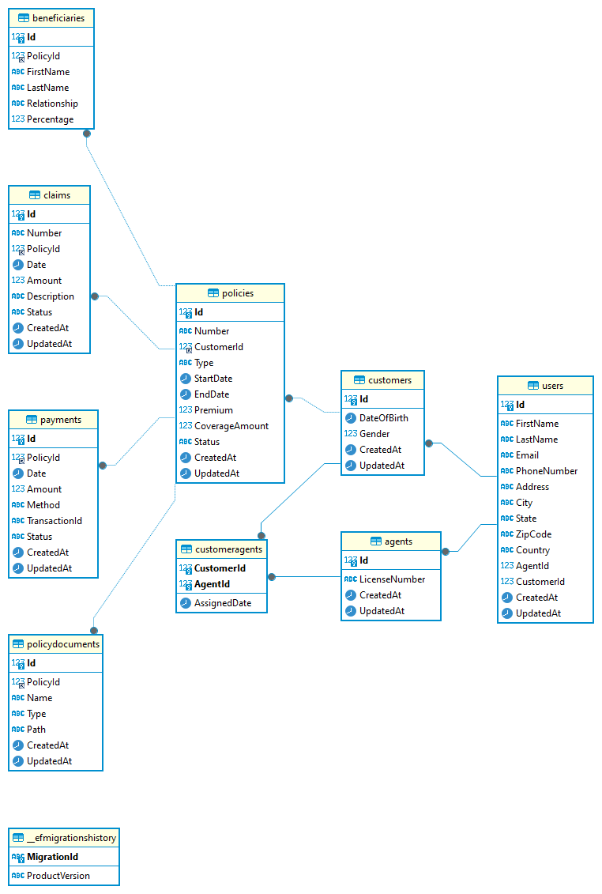

# Insurance Api database example

- This is an example for a database lab lesson
- Entities designed to handle common operations for managing insurance policies, claims, payments, and associated entities.

## Requirement

- Dotnet 8
- MySQL

## Build

Run `dotnet build -tl` to build the solution.

## Run

To run the web application:

```bash
dotnet watch run
```

Navigate to http://localhost:5000.

## Entity Relationship Diagram



## Tables Overview

### 1. Users
The `Users` table stores shared personal information for both customers and agents, including details like names, contact information, and addresses. This table is designed to reduce redundancy by consolidating common attributes between `Customers` and `Agents`.

### 2. Customers
The `Customers` table references the `Users` table to store additional customer-specific information, such as policy ownership and preferences.

### 3. Agents
The `Agents` table also references the `Users` table and includes additional agent-specific information, such as license details and agent roles.

### 4. Policies
The `Policies` table contains data about the insurance policies issued to customers, including policy details like type, coverage, premium, and duration.

### 5. Claims
The `Claims` table records information about claims made against insurance policies, including claim amounts, statuses, and descriptions of the events leading to the claims.

### 6. Payments
The `Payments` table tracks the payments made by customers for their insurance policies, capturing payment details like date, amount, method, and transaction ID.

### 7. CustomerAgents
The `CustomerAgents` table manages the relationship between customers and their assigned agents, keeping track of which agent is responsible for each customer.

### 8. Beneficiaries
The `Beneficiaries` table lists the individuals or entities designated to receive benefits from a policy in the event of a claim, along with their relationship to the policyholder.

### 9. PolicyDocuments
The `PolicyDocuments` table stores references to documents related to policies, such as policy contracts, endorsements, and related paperwork.

## Relationships Overview

- **Users → Customers**: The `Users` table is referenced by the `Customers` table to store customer-specific data.
- **Users → Agents**: The `Users` table is referenced by the `Agents` table to store agent-specific data.
- **Customers → Policies**: A customer can have multiple policies.
- **Policies → Claims**: A policy can have multiple claims.
- **Policies → Payments**: A policy can have multiple payments.
- **Policies → Beneficiaries**: A policy can have multiple beneficiaries.
- **Policies → PolicyDocuments**: A policy can have multiple related documents.
- **Customers → CustomerAgents**: A customer can have one assigned agent.
- **Agents → CustomerAgents**: An agent can be assigned to multiple customers.
